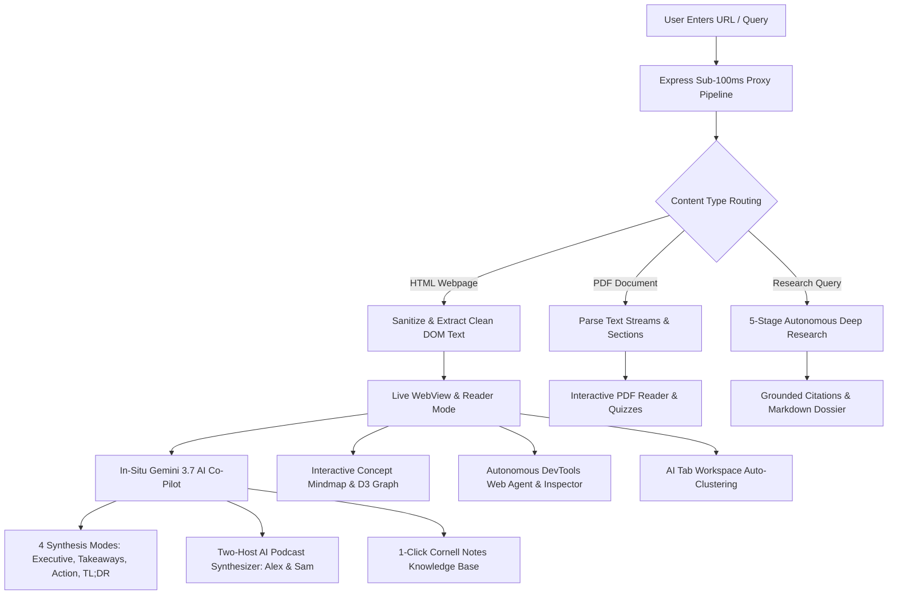

# 🌐 Aksh AI Browser

<div align="center">

<!-- Animated SVG Header Banner -->
<svg viewBox="0 0 800 200" width="100%" height="200" xmlns="http://www.w3.org/2000/svg">
  <defs>
    <linearGradient id="bgGrad" x1="0%" y1="0%" x2="100%" y2="100%">
      <stop offset="0%" stop-color="#0f172a" />
      <stop offset="50%" stop-color="#1e1b4b" />
      <stop offset="100%" stop-color="#0f172a" />
    </linearGradient>
    <linearGradient id="textGrad" x1="0%" y1="0%" x2="100%" y2="0%">
      <stop offset="0%" stop-color="#60a5fa" />
      <stop offset="50%" stop-color="#a855f7" />
      <stop offset="100%" stop-color="#38bdf8" />
    </linearGradient>
    <linearGradient id="glowGrad" x1="0%" y1="0%" x2="100%" y2="100%">
      <stop offset="0%" stop-color="#3b82f6" stop-opacity="0.6"/>
      <stop offset="100%" stop-color="#8b5cf6" stop-opacity="0.1"/>
    </linearGradient>
    <filter id="glow" x="-20%" y="-20%" width="140%" height="140%">
      <feGaussianBlur stdDeviation="8" result="blur" />
      <feComposite in="SourceGraphic" in2="blur" operator="over" />
    </filter>
  </defs>

  <!-- Background Canvas with Rounded Corners -->
  <rect width="800" height="200" rx="16" fill="url(#bgGrad)" stroke="#334155" stroke-width="1.5"/>

  <!-- Subtle Animated Grid Pattern -->
  <g opacity="0.15">
    <line x1="0" y1="40" x2="800" y2="40" stroke="#94a3b8" stroke-dasharray="4 4" />
    <line x1="0" y1="80" x2="800" y2="80" stroke="#94a3b8" stroke-dasharray="4 4" />
    <line x1="0" y1="120" x2="800" y2="120" stroke="#94a3b8" stroke-dasharray="4 4" />
    <line x1="0" y1="160" x2="800" y2="160" stroke="#94a3b8" stroke-dasharray="4 4" />
    <line x1="200" y1="0" x2="200" y2="200" stroke="#94a3b8" stroke-dasharray="4 4" />
    <line x1="400" y1="0" x2="400" y2="200" stroke="#94a3b8" stroke-dasharray="4 4" />
    <line x1="600" y1="0" x2="600" y2="200" stroke="#94a3b8" stroke-dasharray="4 4" />
  </g>

  <!-- Glowing Orb 1 -->
  <circle cx="120" cy="100" r="50" fill="url(#glowGrad)" filter="url(#glow)">
    <animate attributeName="r" values="45;55;45" dur="4s" repeatCount="indefinite" />
    <animate attributeName="opacity" values="0.4;0.8;0.4" dur="4s" repeatCount="indefinite" />
  </circle>

  <!-- Glowing Orb 2 -->
  <circle cx="680" cy="90" r="60" fill="url(#glowGrad)" filter="url(#glow)">
    <animate attributeName="r" values="55;65;55" dur="5s" repeatCount="indefinite" />
    <animate attributeName="opacity" values="0.3;0.7;0.3" dur="5s" repeatCount="indefinite" />
  </circle>

  <!-- Floating Browser Icon (SVG) -->
  <g transform="translate(60, 60)">
    <rect width="64" height="64" rx="16" fill="#1e293b" stroke="#38bdf8" stroke-width="2" />
    <circle cx="16" cy="16" r="3" fill="#ef4444" />
    <circle cx="26" cy="16" r="3" fill="#eab308" />
    <circle cx="36" cy="16" r="3" fill="#22c55e" />
    <circle cx="32" cy="40" r="14" fill="none" stroke="#38bdf8" stroke-width="2.5" stroke-dasharray="5 3">
      <animateTransform attributeName="transform" type="rotate" from="0 32 40" to="360 32 40" dur="10s" repeatCount="indefinite" />
    </circle>
    <circle cx="32" cy="40" r="5" fill="#a855f7">
      <animate attributeName="r" values="4;6;4" dur="2s" repeatCount="indefinite" />
    </circle>
  </g>

  <!-- Title & Subtitle -->
  <text x="145" y="92" font-family="system-ui, -apple-system, sans-serif" font-weight="900" font-size="34" fill="url(#textGrad)" letter-spacing="-0.5">
    AKSH AI BROWSER
  </text>
  <text x="145" y="125" font-family="system-ui, -apple-system, sans-serif" font-weight="500" font-size="14" fill="#94a3b8">
    Next-Generation Intelligent Browser with In-Situ Gemini 3.7 AI & Autonomous Deep Research
  </text>

  <!-- Animated Pulse Radar Dot -->
  <g transform="translate(670, 45)">
    <circle cx="0" cy="0" r="8" fill="#22c55e" opacity="0.2">
      <animate attributeName="r" values="4;14;4" dur="2s" repeatCount="indefinite"/>
      <animate attributeName="opacity" values="0.6;0;0.6" dur="2s" repeatCount="indefinite"/>
    </circle>
    <circle cx="0" cy="0" r="4" fill="#22c55e" />
    <text x="12" y="4" font-family="monospace" font-size="11" font-weight="bold" fill="#4ade80">ONLINE • v2.5</text>
  </g>
</svg>

<br/>

[](https://www.typescriptlang.org/)
[](https://react.dev/)
[](https://tailwindcss.com/)
[](https://expressjs.com/)
[](https://deepmind.google/technologies/gemini/)
[](https://motion.dev/)

<p align="center">
  <b>Reinventing Web Navigation with Real-Time Context Grounding, Deep Multi-Query Synthesis & Autonomous Agents</b>
</p>

</div>

---

## 📑 Table of Contents

- [🌟 Executive Summary](#-executive-summary)
- [🔄 End-to-End System Workflow](#-end-to-end-system-workflow)
- [🏗️ System Architecture & Dataflow](#️-system-architecture--dataflow)
- [⚡ Feature Breakdown & Core Capabilities](#-feature-breakdown--core-capabilities)
  - [1. In-Situ Gemini 3.7 Flash AI Co-Pilot](#1-in-situ-gemini-37-flash-ai-co-pilot)
  - [2. Autonomous Deep Research Engine (`aksh://research`)](#2-autonomous-deep-research-engine-akshresearch)
  - [3. Autonomous Web Agent & DevTools Inspector (`aksh://devtools`)](#3-autonomous-web-agent--devtools-inspector-akshdevtools)
  - [4. Interactive Concept Mindmap & Knowledge Graph (`aksh://mindmap`)](#4-interactive-concept-mindmap--knowledge-graph-akshmindmap)
  - [5. AI Podcastifier & Audio Narrator (Alex & Sam)](#5-ai-podcastifier--audio-narrator-alex--sam)
  - [6. Smart Tab Workspaces & Auto-Grouping](#6-smart-tab-workspaces--auto-grouping)
  - [7. Dual-Pane Split-Screen & Cross-Tab Comparison](#7-dual-pane-split-screen--cross-tab-comparison)
  - [8. PDF Document Intelligence & Study Quizzes (`aksh://pdf`)](#8-pdf-document-intelligence--study-quizzes-akshpdf)
  - [9. Cornell Notes Knowledge Base (`aksh://notes`)](#9-cornell-notes-knowledge-base-akshnotes)
  - [10. Floating Selection AI HUD](#10-floating-selection-ai-hud)
- [🧭 Custom Protocol Scheme (`aksh://*`)](#-custom-protocol-scheme-aksh)
- [⌨️ Global Keyboard Shortcuts](#️-global-keyboard-shortcuts)
- [📡 API Specifications & Routes](#-api-specifications--routes)
- [🚀 Quickstart & Local Development](#-quickstart--local-development)
- [🛡️ Security Architecture & Best Practices](#️-security-architecture--best-practices)

---

## 🌟 Executive Summary

**Aksh AI Browser** is a full-stack, browser-in-browser desktop environment designed to eliminate friction in reading, research, comprehension, and knowledge management across the modern web. Built on **React 19**, **Vite**, **Tailwind CSS v4**, and an **Express proxy backend**, it brings together Chromium-grade browsing controls with **Google Gemini 3.7 Flash**.

Traditional browser extensions operate in isolated sandboxes detached from the real DOM structure. Aksh AI Browser bridges this gap by automatically sanitizing remote markup, extracting clean reading streams, executing multi-source search decompositions, building visual D3 mindmaps, generating dynamic two-host audio podcasts, and capturing structured Cornell study notes.

---

## 🔄 End-to-End System Workflow



---

## 🏗️ System Architecture & Dataflow

```
+-----------------------------------------------------------------------------------------+
|                                    CLIENT (React 19 + Vite)                             |
|                                                                                         |
|  +-----------------+  +-------------------+  +-------------------+  +----------------+  |
|  |    TitleBar     |  |    AddressBar     |  |   BookmarksBar    |  |  ShortcutsModal|  |
|  +-----------------+  +-------------------+  +-------------------+  +----------------+  |
|                                                                                         |
|  +-------------------------------------------------------------+  +------------------+  |
|  |                       ACTIVE VIEWPORT                       |  |  AKSH AI SIDEBAR |  |
|  |  * LiveWebView (Reader mode / iframe proxy / quick summary) |  |  * Gemini 3.7    |  |
|  |  * PDFViewer (Doc reader / study quiz / jump to section)    |  |  * Page Context  |  |
|  |  * ResearchMode (5-stage deep search & citations)          |  |  * 4 Summ Modes  |  |
|  |  * DevToolsView (DOM inspector / agent / security audit)    |  |  * Cornell Notes |  |
|  |  * MindmapView (Interactive visual concept graph)           |  |  * Audio Podcast |  |
|  |  * ProductComparisonView (Specs & benchmark matrix)         |  |  * Export Notes  |  |
|  +-------------------------------------------------------------+  +------------------+  |
+--------------------------------------------▲--------------------------------------------+
                                             │ HTTP REST / JSON
                                             ▼
+-----------------------------------------------------------------------------------------+
|                                  EXPRESS SERVER (server.ts)                             |
|                                                                                         |
|  +---------------------+  +----------------------+  +--------------------------------+  |
|  |   /api/scrape       |  |  /api/ai/chat        |  |  /api/ai/research              |  |
|  |   * Live Web Proxy  |  |  * Gemini 3.7 Flash  |  |  * Multi-Source Search Engine  |  |
|  |   * CORS Bypassing  |  |  * Context Embedding |  |  * Grounded Web Synthesis      |  |
|  |   * HTML Extraction |  |  * Markdown Delivery |  |  * Citation Linking            |  |
|  +---------------------+  +----------------------+  +--------------------------------+  |
|  +---------------------+  +----------------------+  +--------------------------------+  |
|  |   /api/ai/summarize |  |  /api/ai/compare     |  |  /api/ai/podcast               |  |
|  |   * 4 Preset Modes  |  |  * Decision Matrix   |  |  * 2-Host Dialogue Script      |  |
|  +---------------------+  +----------------------+  +--------------------------------+  |
|  +---------------------+  +----------------------+  +--------------------------------+  |
|  | /api/ai/organize-tab|  |  /api/ai/agent-step  |  |  /api/ai/mindmap               |  |
|  | * Workspace Cluster |  |  * DOM Task Exec     |  |  * Graph Nodes & Edges JSON    |  |
|  +---------------------+  +----------------------+  +--------------------------------+  |
+--------------------------------------------▲--------------------------------------------+
                                             │ @google/genai SDK (Server-Side Only)
                                             ▼
                             +-------------------------------+
                             |    GOOGLE GENAI / GEMINI API  |
                             |      (Gemini 3.7 Flash)       |
                             +-------------------------------+
```

---

## ⚡ Feature Breakdown & Core Capabilities

### 1. In-Situ Gemini 3.7 Flash AI Co-Pilot
* **Automatic Page Binding**: The AI sidebar instantly receives the sanitized text of whatever page or PDF is active in the current tab.
* **4 Instant Summarization Modes**:
  1. **Executive Brief**: Comprehensive strategic summary.
  2. **Key Takeaways**: High-signal bulleted core points.
  3. **Action Checklist**: Concrete next steps and actionable tasks.
  4. **TL;DR**: 30-second rapid overview for quick scanning.
* **Cornell Note Synthesizer**: Converts raw web text into high-yield Cornell study notes with cues, questions, and summary blocks with one click.

### 2. Autonomous Deep Research Engine (`aksh://research`)
* **5-Stage Pipeline Progression**:
  1. *Decomposing Query into Sub-Searches*
  2. *Retrieving Live Web Sources & Citations*
  3. *Analyzing Perspectives & Cross-Validating Facts*
  4. *Synthesizing Structured Intelligence Report*
  5. *Finalizing Grounded Citations & Key Findings*
* Generates structured markdown reports with source citations, comparison tables, and direct 1-click **Save to Notes** or **Download as .md**.

### 3. Autonomous Web Agent & DevTools Inspector (`aksh://devtools`)
* **Live Network Telemetry**: Monitors outbound requests, status codes, latency, payload sizes, and method types.
* **Visual DOM Tree**: Interactive hierarchical tag explorer with real-time class inspection and breadcrumb tracking.
* **Security & SSL Audit**: Analyzes TLS grade, Mixed Content status, and Content Security Policies.
* **Autonomous Goal Agent**: Set a browsing goal (e.g., *"Find the latest benchmark comparison table and copy data"*), and the agent breaks it down into executable DOM steps.

### 4. Interactive Concept Mindmap & Knowledge Graph (`aksh://mindmap`)
* Converts any webpage topic or research area into an interactive D3-powered concept graph.
* Clusters nodes into **Core Themes**, **Supporting Technologies**, **Applications**, **Challenges**, and **Future Frontiers**.
* Click any node to reveal detailed contextual descriptions and related concept edges.

### 5. AI Podcastifier & Audio Narrator (Alex & Sam)
* Transform any long-form article or paper into a dynamic **two-host podcast dialogue**.
* Features synthetic voice narration with adjustable playback speeds (`0.75x`, `1.0x`, `1.25x`, `1.5x`).
* Real-time synchronized dialogue drawer with 1-click script copying.

### 6. Smart Tab Workspaces & Auto-Grouping
* One-click **Smart Group** analyzes active tab titles and snippets using Gemini.
* Clusters related tabs into semantic workspaces (e.g. *Research*, *Engineering*, *Learning*) with custom left-accent color indicators and contiguous sorting.

### 7. Dual-Pane Split-Screen & Cross-Tab Comparison
* Browse two tabs side-by-side with customizable viewport ratios (`50/50`, `70/30`, `30/70`).
* Features an AI **Compare Tabs** engine that performs cross-page comparative analysis, identifying overlaps, differences, and recommendations.

### 8. PDF Document Intelligence & Study Quizzes (`aksh://pdf`)
* In-browser PDF document reader with section jumping, search filtering, and zoom controls.
* **Interactive Quizzer**: Generates multiple-choice study quizzes directly from research papers with real-time scoring, explanations, and celebratory confetti.

### 9. Cornell Notes Knowledge Base (`aksh://notes`)
* Centralized markdown knowledge repository.
* Tag filtering, search indexing, and 1-click export to standard `.md` or `.json` files compatible with Obsidian, Notion, and Logseq.

### 10. Floating Selection AI HUD
* Highlight any text on a webpage to reveal a floating HUD offering instant:
  * **Explain**: High-level conceptual breakdown.
  * **Translate**: Live translation to Spanish, French, German, Hindi, Japanese, or Chinese.
  * **Fact Check**: Verifies assertions against ground-truth datasets.
  * **Flashcard**: Formats text into question-answer flashcards for spaced repetition.

---

## 🧭 Custom Protocol Scheme (`aksh://*`)

| URL Scheme | Target View | Description |
| :--- | :--- | :--- |
| `aksh://newtab` | **New Tab Homepage** | Speed dial, search bar, and interactive workflow pipeline |
| `aksh://research` | **Deep Research Mode** | Autonomous multi-source AI research engine |
| `aksh://mindmap` | **Concept Graph** | Visual interactive concept mindmap & knowledge explorer |
| `aksh://devtools` | **DevTools & Agent** | DOM tree, network logs, security audit & autonomous agent |
| `aksh://pdf` | **PDF Intelligence** | In-browser document viewer, section parser & AI quiz |
| `aksh://notes` | **AI Knowledge Base** | Saved summaries, research dossiers & markdown exporter |
| `aksh://comparison` | **Decision Matrix** | Side-by-side product benchmark comparison |
| `aksh://history` | **Browsing History** | Chronological timeline of visited URLs |
| `aksh://bookmarks` | **Bookmarks Manager**| Tagged folders, custom URLs & JSON export |
| `aksh://downloads` | **Downloads Manager**| File download tracker with progress bars |
| `aksh://settings` | **Browser Settings** | AI configuration, theme, search engine & keyboard shortcuts |
| `aksh://readme` | **System Documentation** | Interactive documentation and architecture manual |

---

## ⌨️ Global Keyboard Shortcuts

| Shortcut | Action | Description |
| :--- | :--- | :--- |
| `Ctrl + K` / `⌘ + K` | **Spotlight Command Palette** | Universal command launcher and open-tab search |
| `Ctrl + J` / `⌘ + J` | **Toggle AI Co-Pilot** | Open or collapse the Gemini 3.7 AI sidebar |
| `Ctrl + T` / `⌘ + T` | **New Tab** | Create a new tab with the speed dial homepage |
| `Ctrl + W` / `⌘ + W` | **Close Active Tab** | Safely close the active browsing tab |
| `Ctrl + R` / `⌘ + R` | **Reload Page** | Refresh webpage and re-fetch DOM text |
| `Ctrl + M` / `⌘ + M` | **Open Mindmap** | Launch interactive knowledge graph for active topic |
| `Ctrl + H` / `⌘ + H` | **Open History** | View chronological timeline of visited URLs |
| `Ctrl + B` / `⌘ + B` | **Open Bookmarks** | Manage saved bookmarks and folders |
| `F12` / `Ctrl+Shift+I` | **Open DevTools** | Launch DOM inspector, network logs & web agent |
| `?` (outside input) | **Shortcuts Cheat Sheet** | Open keyboard shortcuts modal |

---

## 📡 API Specifications & Routes

All API endpoints reside on the server side to ensure total API key security.

### 1. `POST /api/scrape`
Proxies and sanitizes web pages to extract clean readability text.
```json
// Request Payload
{
  "url": "https://en.wikipedia.org/wiki/Artificial_intelligence"
}

// Response Payload
{
  "title": "Artificial intelligence - Wikipedia",
  "content": "<div class=\"prose\">...</div>",
  "textContent": "Artificial intelligence is the intelligence of machines...",
  "headings": ["History", "Goals", "Applications"]
}
```

### 2. `POST /api/ai/chat`
Conversational AI co-pilot with active webpage / PDF context grounding.
```json
// Request Payload
{
  "message": "What are the primary challenges mentioned in this paper?",
  "pageContext": "Full extracted text of active page...",
  "chatHistory": [],
  "mode": "general"
}

// Response Payload
{
  "reply": "Based on the provided text, the primary challenges are..."
}
```

### 3. `POST /api/ai/research`
Autonomous deep research pipeline with live citation synthesis.
```json
// Request Payload
{
  "query": "Quantum Computing breakthroughs 2026",
  "depth": "deep"
}

// Response Payload
{
  "report": {
    "summary": "### Executive Overview\n\nRecent milestones in neutral-atom qubits...",
    "sources": [
      { "title": "Nature Physics Review", "url": "https://nature.com/articles/...", "snippet": "..." }
    ]
  }
}
```

### 4. `POST /api/ai/podcast`
Generates a two-host conversational briefing script (`Alex & Sam`).
```json
// Request Payload
{
  "title": "Autonomous AI Agents in Web Browsing",
  "url": "https://example.com/agents",
  "content": "Full article body..."
}

// Response Payload
{
  "script": "Alex: Welcome back everyone!\nSam: Today we're looking at something wild...",
  "spokenText": "Alex: Welcome back everyone! Sam: Today we're looking at..."
}
```

---

## 🚀 Quickstart & Local Development

### Prerequisites
- **Node.js**: v18.0.0 or higher (or Bun)
- **Gemini API Key**: Obtainable from [Google AI Studio](https://aistudio.google.com/)

### Step-by-Step Installation

1. **Clone the Repository**:
   ```bash
   git clone https://github.com/your-username/aksh-ai-browser.git
   cd aksh-ai-browser
   ```

2. **Install Dependencies**:
   ```bash
   npm install
   ```

3. **Configure Environment Variables**:
   Create a `.env` file in the root directory:
   ```env
   GEMINI_API_KEY=your_gemini_api_key_here
   ```

4. **Launch Local Development Server**:
   ```bash
   npm run dev
   ```
   Open `http://localhost:3000` in your web browser.

5. **Build for Production**:
   ```bash
   npm run build
   npm start
   ```

---

## 🛡️ Security Architecture & Best Practices

- **Zero Client-Side Secret Leakage**: The Google Gemini API key is strictly evaluated in `server.ts` through `process.env.GEMINI_API_KEY`. No API keys are ever bundled into client JavaScript.
- **Sub-100ms Proxy Sanitization**: Outbound requests strip untrusted `<script>` execution contexts and CSP blockers while preserving text structure and semantic tags.
- **Production Bundling**: Bundled with `esbuild` to a single CommonJS server output (`dist/server.cjs`) ensuring instant container startup and zero module resolution overhead.

---

<div align="center">
  <sub>Built with precision using <b>Google Gemini 3.7 Flash</b>, <b>React 19</b>, <b>Tailwind CSS v4</b>, and <b>Express</b>.</sub>
</div>
